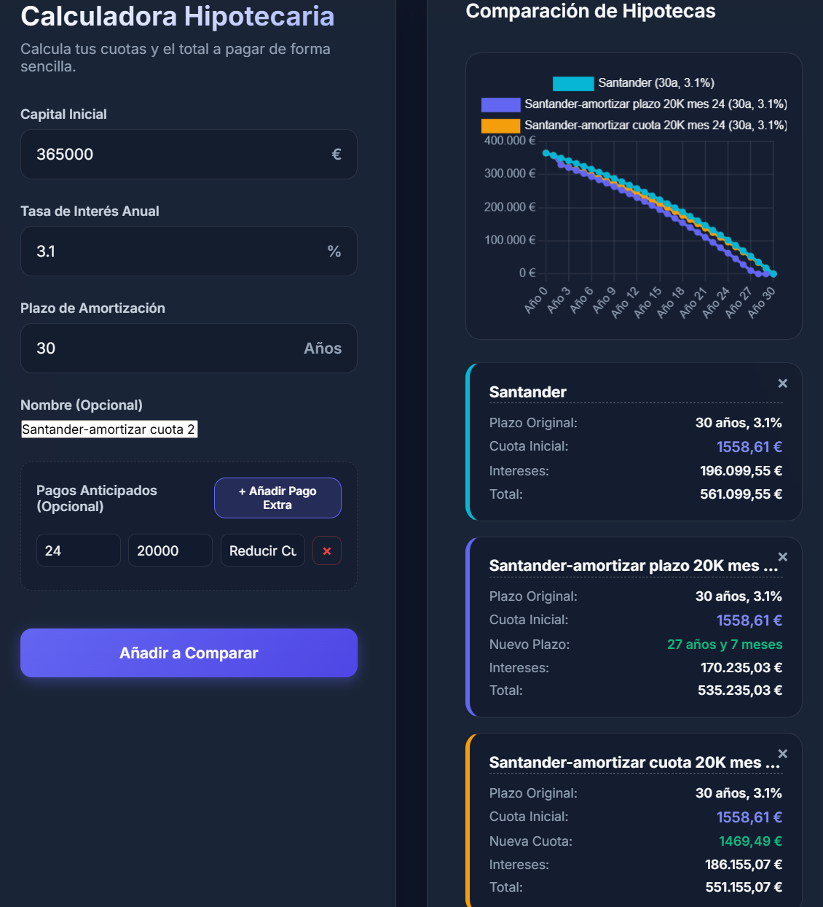
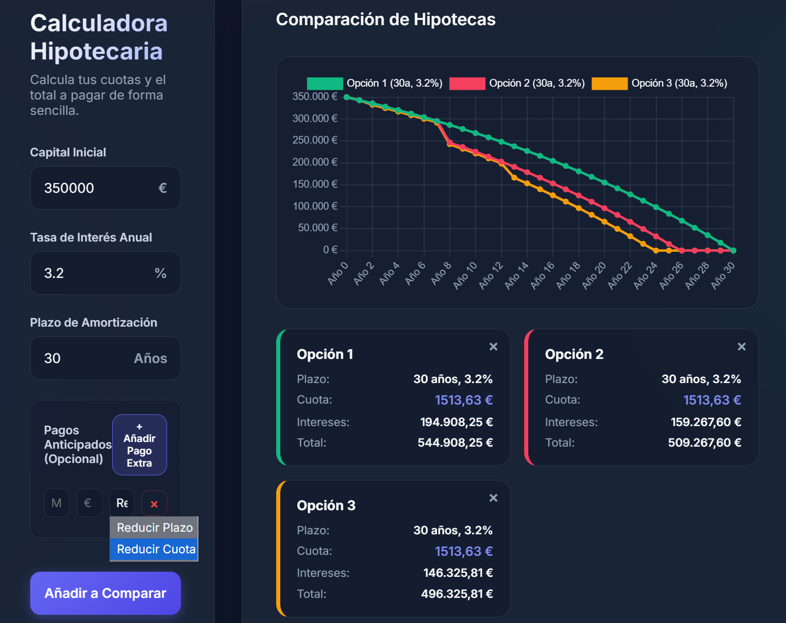

# Calculadora Hipotecaria DebtDrop

[](https://codecov.io/gh/emikeb/DebtDrop)

Sencilla de usar y muy útil para comparar hipotecas en local sin compartir información en herramientas online y pudiendo modificarla a gusto personal. Usada para mi proceso de hipoteca.




**¿Por qué usar DebtDrop?**
- 🚀 **Fácil de usar**: Interfaz funcional y directa, sin distracciones, facil comparar todas las ofertas en la misma interfaz y gráfica.

- 🔒 **Privacidad total**: Se ejecuta en local. No envías ni compartes tus datos financieros con herramientas online de terceros.

- 🛠️ **Personalizable**: Al ser tuya, puedes modificarla y ajustarla a tu gusto personal.

## Arquitectura

El proyecto separa responsabilidades utilizando una arquitectura de microservicios:

* **Backend (`/backend`)**: API de alto rendimiento desarrollada en Python usando **FastAPI** y validación de esquemas con **Pydantic**.
* **Frontend (`/frontend`)**: Una interfaz de usuario puramente funcional y refinada utilizando Vanilla JS, CSS3, y HTML5, servida por **Nginx**.
* **Proxy**: Nginx se utiliza como proxy inverso, redirigiendo todas las peticiones bajo la ruta `/api/` de red local de Docker hacia FastAPI, para evitar cualquier problema de CORS.

## Requisitos Previos

- [Docker](https://www.docker.com/) y [Docker Compose](https://docs.docker.com/compose/)
- [Just](https://github.com/casey/just) (Opcional, pero recomendado como task runner)

## ¿Cómo Ejecutar la Aplicación?

El proyecto incluye un archivo `justfile` para facilitar el ciclo de vida del desarrollo.

Si tienes `just` instalado en tu sistema, usa:

- `just run` o `just up`: Construye y levanta los servicios en segundo plano (`localhost:80`).
- `just down`: Detiene y elimina los contenedores activos de la red local.
- `just logs`: Muestra el historial de eventos e impresiones de la consola local.
- `just restart`: Reinicia ambas instancias forzando una nueva compilación base de imágenes.

Si **no** tienes `just` configurado, puedes utilizar los comandos nativos de docker compose:

```bash
docker-compose up -d --build  # Iniciar la aplicación
docker-compose down           # Detener la aplicación
docker-compose logs -f        # Ver los logs en tiempo real
```

Una vez levantados los contenedores, verifica su funcionamiento accediendo a [http://localhost](http://localhost) desde tu navegador preferido.
